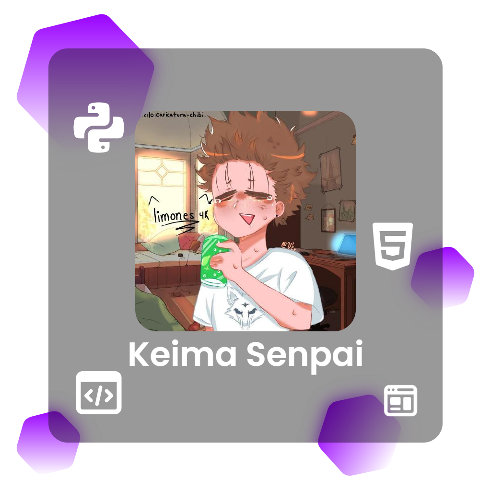

    

# 👋🏻Hola soy Keima Senpai

Soy programador si no no estuviera en GitHub jajaja. Aunque estoy aprendiendo ya e creado varios proyectos los cuales pueden ver en mi repo de GitHub. Hago videos en YouTube mostrado y enseñando a muchas personas las grandes cosas que se pueden hacer gracias a la programación, además de ir mostrando lo que voy aprendiendo.

### 👨🏻‍💻Las tecnologías que domino son:

- Python 3 años
- Django 5 meses
- Flet 8 meses
- Astro 2 meses

### 💼Los trabajos que acepto son:

- Creación de servers de Minecraft
- Diseño de logos, banners, portadas para tu negocio canal de YouTube etc
- Creación de app de escritorio
- Cear una web, landing page o encommerse

    

### 📺Mis ultimos vídeos
<!-- YOUTUBE:START -->
- [Servicio de Descargas Gratis en CUBA](https://www.youtube.com/watch?v=YztcnMQkv7E)
- [CREA TU PROPIO LAUNCHER de MINECRAFT](https://www.youtube.com/watch?v=5FmjSubDRyw)
- [Tengo nuevo video sobre nueva actualización del X Minecraft Launcher #minecraft #launchers](https://www.youtube.com/watch?v=j0BC_Xdkrow)
- [NUEVO LAUNCHER para MINECRAFT](https://www.youtube.com/watch?v=3ql5j02x0IQ)
- [Creando un SERVER de MINECRAFT desde 0 [ Elección de Plugins ]](https://www.youtube.com/watch?v=WqCGpiXZo4A)
<!-- YOUTUBE:END -->
➡️ [Más vídeos...](https://www.youtube.com/@KeimaSenpaiYT)

    

